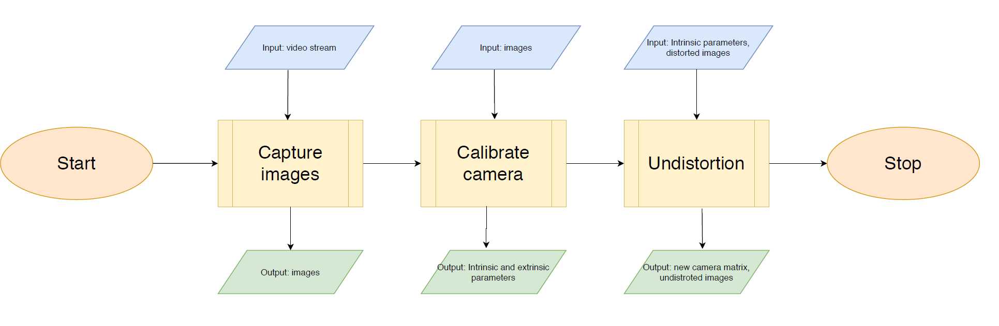
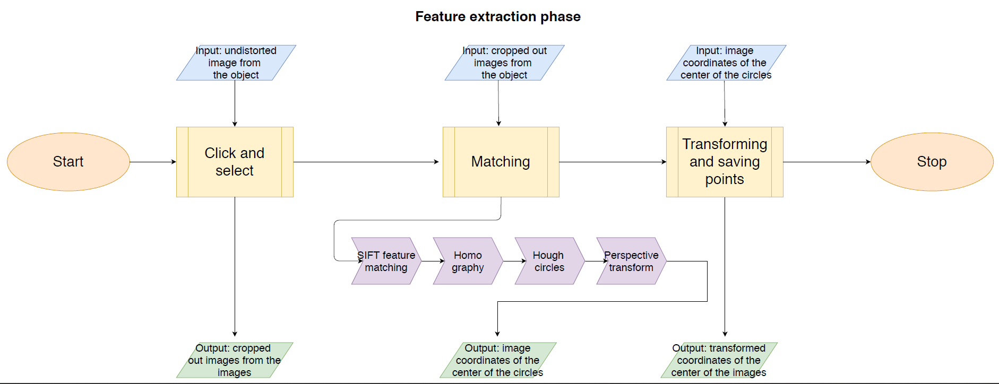
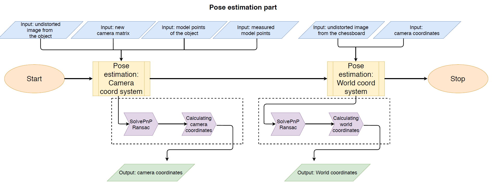
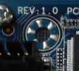
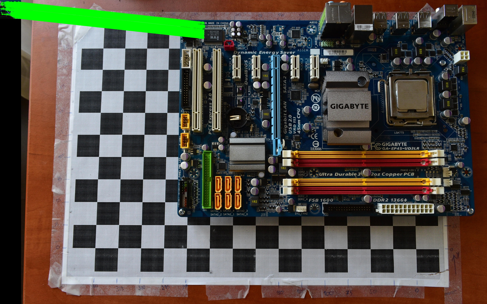
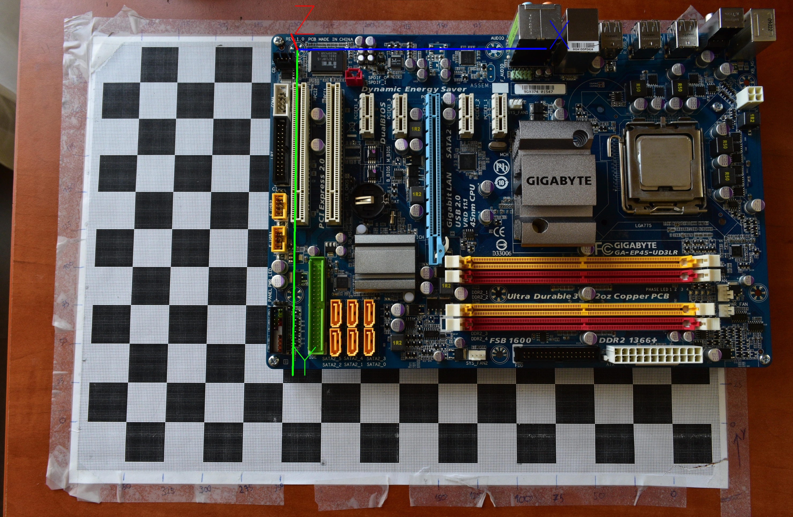

# Optical pose estimation in robotics applications
Nowadays, Machine Vision has become very common and popular in the field of robotics, especially when it comes down to 
precise measurements. Combining these two fields has made many previously difficult or insoluble tasks feasible. 
There are many factors that can affect the exact measurement of different components. These include, for example, 
various distortions (e.g. barrel, pincushion) on the images, handling the case of occluded points, poor lighting 
conditions and poor image quality. All this must be considered and eliminated during implementation.

Camera calibration and image undistortion are standard operations within the field of Computer Vision. All of these are
the basis of fundamental tasks such as pose estimation and optical measurements of objects. The common solution to find
certain key points on images is to use different feature matching algorithms, such as SIFT 
(Scale Invariant Feature Transform) or SURF (Speeded Up Robust Features). For pose estimation, the classic way is the
PnP (Perspective-n-Point) algorithm.

The goal of this thesis is to design a measurement process for the pose estimation of different electrical components 
such as motherboards, memory modules, CPUs, etc. To facilitate the implementation of the task, the OpenCV software 
library should be used. This directory contains all the essential image processing functions necessary to accomplish
this task. The final step in the work is testing the system with different objects and then thoroughly evaluating the 
measured data.

## Overview of the pipeline
As the figures show below, the processing chain can be divided up to three main stages.
In order, these are:
- Calibration
- Feature matching
- Pose estimation

The first stage is called calibration. This stage includes sub-steps such as
image capturing, camera calibration - to extract intrinsic and extrinsic parameters -
and image undistortion.

<figure align="center">
  <figcaption>Calibration phase</figcaption>
  
</figure>

In the second stage, the feature extraction is realized with
the aid of different image processing algorithms (e.g. SIFT, Hough circles,
homography). 

<figure align="center">
  <figcaption>Feature matching phase</figcaption>
  
</figure>

The last stage is where the measurement is actually carried out.
In the last stage, using the data of the previous stage, the PnP algorithm finds
the object pose from 3D-2D point correspondences, and determines the position of
the object by further calculations.

<figure align="center">
  <figcaption>Pose estimation phase</figcaption>
  
</figure>

## Requriments
Make sure you have the following dependencies installed:

| Package               | Version    |
|-----------------------|------------|
| colorama              | 0.4.6      |
| colorlog              | 6.8.2      |
| numpy                 | 1.26.4     |
| opencv-contrib-python | 4.9.0.80   |
| opencv-python         | 4.9.0.80   |
| pandas                | 2.2.1      |
| pip                   | 23.2.1     |
| python-dateutil       | 2.9.0.post0|
| pytz                  | 2024.1     |
| six                   | 1.16.0     |
| tqdm                  | 4.66.2     |
| tzdata                | 2024.1     |

## Installation
First clone this repo, or download it. In the `const.py` file you will find this:

```python
root_mapping = {
    "rrb12": {
        "DATA_ROOT":
            "C:/Users/rrb12/Documents/project/storage"
    }
}
```

Change the key in the dict and the path accordingly. Key should be your username in your OS. Select a path where you 
would like to save images and other data. Also, it has to be an existing folder.

## How to use
### Calibration
The first program in the pipeline is the camera image capture program - `take_images.py`. It is a
fundamental, simple and useful tool.
In the image window, where we can see the live stream from the camera,
when the program detects that the button `[c]` is pressed, it captures a frame from the
stream, and saves it into the previously defined directory. We save an image from the motherboard with the button 
`[m]` and we use the button `[b]` to save a single image from the chessboard.

The next program in the chain is the camera calibration program. The point
of camera calibration is to yield the intrinsic parameters of the camera module and
to use these parameters in further processing, such as eliminating lens distortion,
measure the size of an object in world units, or determine the location of the camera
in the scene. To calibrate the camera, the initial step was to take pictures of a
chessboard.

A chessboard is often used as calibration sample because it has regular, high
contrast patterns that makes it easy to detect automatically with OpenCV functions.
This step is crucial in case to find point correspondences between real-world points
and their matching projection. It is recommended to take as many pictures as
possible by placing the chessboard in as many places as possible. There are two
ways to take pictures: the chessboard stays static and we take multiple images of
the checkerboard by moving the camera only. In another way, the camera is stayed
as fixed, and we move only the chessboard instead. During a session, we usually take
about 60-80 different images.

Before executing the `camera_calibration.py` make sure to set everything accordingly in `config.py`, within the
`CameraAndCalibrationConfig` class.

The program not only calculates the new, undistorted camera matrix, but also saves it with other parameters. 
Additionally, it undistort the images taken for calibration.

### Feature matching

At this part of the pipeline, the next step is the feature extraction. In case of the motherboard object, 
the keypoints correspond to the mounting holes  according to the ATX standard specification. Therefore, the 
program has to find these circle shaped points, and save the image coordinates represented as the center
of the circles.

<figure align="center">
  <figcaption>Example for a ROI image</figcaption>
  
</figure>

If no ROI images are present, first you have to select them in a strict order. After all mounting holes are selected,
the program will find the centers of these holes, in pixel coordinates, and will save them.

<figure align="center">
  <figcaption>Example for a pairing</figcaption>
  
</figure>

### Pose estimation

The last step in the elaborated image processing pipeline is the pose estimation. In
this code, we compute the pose of the object (e.g. motherboard) with known key-points, and visually 
check if the measurements were right. Estimating the pose of an object means finding the values both
for translation and rotation (3-3).

The program finds the latest undistorted image from the mother- and chessboard, and the latest camera matrix as well.
Other files are also loaded, like the mother- and chessboard model coordinates, so does the previously saved motherboard 
pixel coordinates.

First it calculates the coordinates of the motherboard in the camera coordinate system, then in the world coordinate 
system.

<figure align="center">
  <figcaption>Pose of the object</figcaption>
  
</figure>
